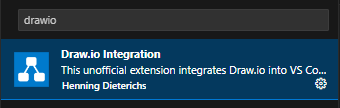
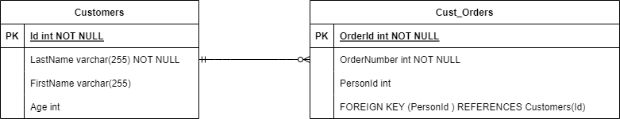

###########
Style Guide
###########

This section gives an overview of reStructured Text elements. 

.. _contents:

********
Contents
********

.. contents:: Table of contents

***********
Text blocks
***********

White spaces
============

White spaces are ignored when text blocks are rendered.

**Example** 

.. code-block:: rst

   This is a     text containing   white 
   spaces in form   of spaces
   and newlines.

**Rendered** 

This is a     text containing   white 
spaces in form   of spaces
and newlines.

Indentation
===========

Use consistent indentation throughout your document. 
While reStructuredText doesn't prescribe a specific number of spaces, it's common to use 3 or 4 spaces for indentation, 
especially when nesting structures. To have a common layout use 3 indentations. 

VS Code can be configured to replace tabs with spaces: 

* Click on the status bar item that displays the current indentation settings, usually located on the bottom right. This item will typically show "Spaces: 3/4"
* Select "Convert Indentation to Spaces" from the menu that appears.
* Select 3 spaces from the menu.

Inline Markup
=============
Use `Inline markup`_ for formating text. 

Emphasis
--------
One asterisk for emphasis(italics).

**Example**

.. code-block:: rst

   This is *emphasized* text.

**Rendered**

This is *emphasized* text.

Strong
------

Two asterisks for strong emphasis (boldface).

**Example**

.. code-block:: rst

   This is **strong** text.

**Rendered**

This is **strong** text.

Code samples
------------

Backquotes for code samples.

**Example**

.. code-block:: rst

   This is ``code`` text.

**Rendered**

This is ``code`` text.

********
Sections
********

`Sections`_  structure a document and are created by overlines/underlines with special charaters. 
There is no fixed number and order of section title adornment styles, the order enforced will be the order as encountered. 

**Example**

.. code-block:: rst

   ####################
   H1 Headline level 1.
   ####################

   ********************
   H2 Headline level 2.
   ********************

   H3 Headline level 3.
   ====================

   H4 Headline level 4.
   --------------------

   H5 Headline level 5.
   ^^^^^^^^^^^^^^^^^^^^

   H6 Headline level 6.
   """"""""""""""""""""

********
Comments
********

Writing comments which are not rendered is done by starting a line with two dots and then a space.

**Example** ::

    .. This is a single line comment. 

    ..
        This is a block
        comment. 

**Rendered**

Nothing is rendered, comment is only visible in `*`.rst. 

*************
Code examples
*************

There are multiple possibility to show code examples "as they are":

* Literal blocks
* code-block directive

Literal blocks
==============

`Literal blocks`_ can be used as inline code. They are not rendered. They start with `::` and are indented.

**Example** 

:: 

   This is a normal text paragraph. 
  
   ::

     # this is program code, shown as it is
     for a in [5,4,3,2,1]:   
       print a  

   Continuing with normal paragraph.

**Rendered**

This is a normal text paragraph. 

::

   # this is program code, shown as it is
   for a in [5,4,3,2,1]:   
     print a  

Continuing with normal paragraph.

Code block directive
====================

`Code-block`_ directive can be used as inline code. They are not rendered. They start with `.. code::` directive followed by the language. 

**Example**

.. code-block:: rst

   .. code-block:: python

      # this is program code, shown as it is
      for a in [5,4,3,2,1]:
         print a
  

**Rendered**

.. code-block:: python

   # this is program code, shown as it is
   for a in [5,4,3,2,1]:
      print a
  

******
Tables
******

`Tables`_  can be created as:

* Grid table or as
* Simple table

Grid tables
===========

`Grid tables`_ can be used to "draw" the table which is rendered.

**Example**

.. code-block:: rst

   +-----------+-----------+-----------+
   | A         | B         | AND       |          
   +===========+===========+===========+
   | False     | False     | False     | 
   +-----------+-----------+-----------+
   | True      | Talse     | False     | 
   +-----------+-----------+-----------+
   | False     | True      | False     | 
   +-----------+-----------+-----------+
   | True      | True      | True      | 
   +-----------+-----------+-----------+

**Rendered**

+-----------+-----------+-----------+
| A         | B         | AND       |          
+===========+===========+===========+
| False     | False     | False     | 
+-----------+-----------+-----------+
| True      | Talse     | False     | 
+-----------+-----------+-----------+
| False     | True      | False     | 
+-----------+-----------+-----------+
| True      | True      | True      | 
+-----------+-----------+-----------+

Simple tables
=============

`Simple tables`_ are limited but easier to create. 

**Example**

.. code-block:: rst

   =====  =====  =======
   A      B      AND
   =====  =====  =======
   False  False  False
   True   False  False
   False  True   False
   True   True   True
   =====  =====  =======

**Rendered**

=====  =====  =======
A      B      AND
=====  =====  =======
False  False  False
True   False  False
False  True   False
True   True   True
=====  =====  =======

Lists
=====

`Lists`_ can be used for (ordered) elements or to define terms. 

Numbered lists
--------------

.. code-block:: rst

   Things I hate:

   1. Jokes
   2. Lists
   3. Irony
   4. Lists
   5. Repetition

**Rendered**

Things I hate:

1. Jokes
2. Lists
3. Irony
4. Lists
5. Repetition

Autonumbered lists
------------------

**Example**

.. code-block:: rst

   Things I hate:

   #. Jokes
   #. Lists
   #. Irony
   #. Lists
   #. Repetition

**Rendered**

Things I hate:

#. Jokes
#. Lists
#. Irony
#. Lists
#. Repetition

Bullet lists
------------

**Example**

.. code-block:: rst

   Things I hate:

   * Jokes
   * Lists
   * Irony
   * Lists
   * Repetition

**Rendered**

Things I hate:

* Jokes
* Lists
* Irony
* Lists
* Repetition

Term lists
----------

**Example**

.. code-block:: rst

   Things I hate:

   Jokes
      Something funny.
   Lists
      Ordered elements.
   Irony
      Meaning the opposite.

**Rendered**

Things I hate:

Jokes
   Something funny.
Lists
   Ordered elements.
Irony
   Meaning the opposite.

**********
Images
**********

`Images`_ can be included with the image directive. 

**Example**

.. code-block:: rst

   .. image:: ./images/draw_io_extension.png
      :alt: DrawIo extension for Visual Studio Code
      :align: center

**Rendered**

Drawio.png
==========

Use eiter `*`.drawio.png or `*`.drawio.svg files to include drawio diagrams. `DrawIo extension for Visual Studio Code`_ can be used to create the diagrams. 
A `*`.drawio.png file functions as both a PNG image and a source file for Draw.io diagrams. 
You can view it as an image in any software that supports PNGs, and you can also edit the diagram by opening the same file in Draw.io or compatible software.

Drawio sql
==========

DrawIo can generate `*`.drawio.png files based on SQL statements with the `DrawIo-Sql-Plugin`_. 

Tables are created, relationships have to be drawn manually. 

.. tip::
   Change the background of the drawio.png file to white. Otherwiese only parts are visible

.. note::
   Foreign key dependencies are not generated correct. Instead the dependency is shown as an attribute 

How-To: 

* install draw-io plugin in visual studio 
* create a drawio.png file 
* click on the `+` button and select "Advanced" - "SQL". 
* Use a Create SQL statement and click on generate
* Select "More Shapes" button and under Software select "Entity Relation". Draw relationships.

.. code-block:: sql

   CREATE TABLE Customers(
      Id int NOT NULL,
      LastName varchar(255) NOT NULL,
      FirstName varchar(255),
      Age int,
      PRIMARY KEY (Id)
   );

   CREATE TABLE Cust_Orders(
      OrderId int NOT NULL,
      OrderNumber int NOT NULL,
      PersonId int,
      PRIMARY KEY (OrderId),
      FOREIGN KEY (PersonId ) REFERENCES Customers(Id)
   );
   

Generated drawio.png file:

PlantUML
========

PlantUML can be used to create E/R diagrams. In contrast to drawio.png files, those diagrams are text based and can be compared easily.

.. note:: 
   To render PlanUML diagrams java and PlantUML.jar is required at the host machine and conf.py has to be adapted. 

.. todo::
   Add description how to install PlantUML

.. todo:: 
   Add description how to setup a local environment at all

   
**Example**    

.. code-block:: rst

   .. uml::

      @startuml

      entity "Customers" as customers {
         + Id : int <<PK>>
         --
         LastName : string
         FirstName : string
         Age : int
      }

      entity "Cust_Orders" as orders {
         + OrderId : int <<PK>>
         --
         OrderNumber : int
         CustomerId : int <<FK>>
      }

      customers --o{ orders : "has"

      @enduml

**Rendered**

.. uml::

   @startuml

   entity "Customers" as customers {
      + Id : int <<PK>>
      --
      LastName : string
      FirstName : string
      Age : int
   }

   entity "Cust_Orders" as orders {
      + OrderId : int <<PK>>
      --
      OrderNumber : int
      CustomerId : int <<FK>>
   }

   customers --o{ orders : "has"

   @enduml

************
Admonition
************

Admonition blocks are used to highlight a text.

Notes
=====

**Example**

.. code-block:: rst

   .. note::
      This is a note admonition.

**Rendered**

.. note::
   This is a note admonition.

Warnings
========

**Example**

.. code-block:: rst

   .. warning::
      This is a warning admonition. 

**Rendered**

.. warning::
   This is a warning admonition.

Errors
======

**Example**

.. code-block:: rst

   .. error::
      This is an error admonition.

**Rendered**

.. error::
   This is an error admonition.

.. _links:

******
Links
******

Links to external sites
=======================

`External Links`_ can be created by using the `link text <url>`_ syntax.

**Example**

.. code-block:: rst

   `Link to google <http:\\www.google.com>`_

**Rendered**

   `Link to google <http:\\www.google.com>`_

Target Notes
===============

You can also separate the link and the target definition (ref), like this:

**Example**

.. code-block:: rst

   This is a paragraph that contains `a link to google`_.

   .. _a link to google: http:\\www.google.com

**Rendered**

This is a paragraph that contains `a link to google`_.

.. _a link to google: http:\\www.google.com

Especially with the `.. target-notes::` directive, this can be useful to avoid cluttering the text with links and all links can be collected at the end of the document.

Cross-references
================

You can define a reference label by using the `.. my-lable-name:` and refere to it y using the `:ref:my-lable-name` directive. 
If such a lable is placed before a section/table or image, the section/table or image can be referenced. 

**Example** 

.. code-block:: rst

   .. defining a link referencs before a section
   
   .. _links:
   ******
   Links
   ******

   .. using the link reference to the section
   This is a paragraph that contains a reference to the :ref:`Links` section.

**Rendered**

This is a paragraph that contains a reference to the :ref:`Links` section.

Table of contents
=================

The `.. contents::` directive can be used to create a table of contents.

**Example**

.. code-block:: rst

   .. contents:: Table of contents

**Rendered**

Refer to section :ref:`contents` for the table of contents.

**********
References
**********

.. target-notes::

.. _`Literal blocks` : https://docutils.sourceforge.io/docs/ref/rst/restructuredtext.html#literal-blocks
.. _`Code-block` : https://www.sphinx-doc.org/en/master/usage/restructuredtext/directives.html#directive-code-block
.. _`Sections` : https://docutils.sourceforge.io/docs/ref/rst/restructuredtext.html#sections
.. _`Tables` : https://www.sphinx-doc.org/en/master/usage/restructuredtext/basics.html#tables
.. _`Grid tables` : https://docutils.sourceforge.io/docs/ref/rst/restructuredtext.html#grid-tables
.. _`Simple tables` : https://docutils.sourceforge.io/docs/ref/rst/restructuredtext.html#simple-tables
.. _`Lists` : https://www.sphinx-doc.org/en/master/usage/restructuredtext/basics.html#lists-and-quote-like-blocks
.. _`Inline markup` : https://www.sphinx-doc.org/en/master/usage/restructuredtext/basics.html#inline-markup
.. _`Images` : https://docutils.sourceforge.io/docs/ref/rst/directives.html#image
.. _`DrawIo extension for Visual Studio Code` : https://marketplace.visualstudio.com/items?itemName=hediet.vscode-drawio
.. _`DrawIo-Sql-Plugin` : https://www.drawio.com/doc/faq/sql-plugin
.. _`External links` : https://www.sphinx-doc.org/en/master/usage/restructuredtext/basics.html#hyperlinks

*******************
To-Do List
*******************

Issues to be fixed in this documentation:

.. todolist::